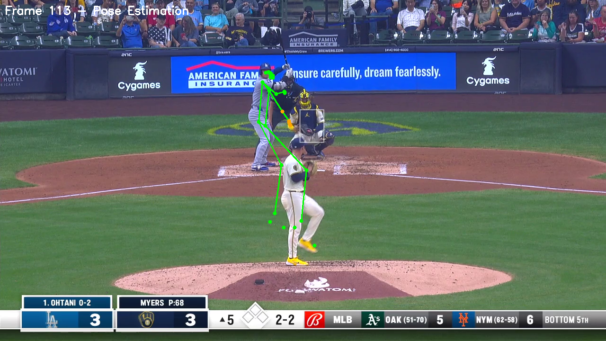

# Baseball Biomechanics Analysis Pipeline

A Python pipeline for analyzing baseball player biomechanics using computer vision. Scrapes pitch videos from Baseball Savant, segments individual players (pitcher, batter, catcher), runs pose estimation on isolated crops, and stores keypoint data linked to Statcast metrics.

## Key Innovation: Multi-Player Isolation

Standard pose estimation on baseball broadcast footage creates **"Frankenstein" poses** - mixing body parts from multiple players (e.g., batter's head with pitcher's legs). This pipeline solves that by:

1. **YOLO Detection** - Detect all persons in frame
2. **Position Classification** - Classify each detection as pitcher/batter/catcher based on screen position
3. **Isolated Crops** - Extract bounding box crops for each player
4. **Clean Pose Estimation** - Run MediaPipe on isolated crops for accurate per-player poses



## Features

- **Video Scraping**: Download pitch videos and Statcast data from Baseball Savant
- **Multi-Player Segmentation**: YOLO + position heuristics to isolate pitcher, batter, and catcher
- **Pose Estimation**: MediaPipe Pose Landmarker (33 keypoints per player)
- **Database Storage**: SQLite database linking pose sequences to Statcast metrics
- **CLI Interface**: Command-line tools for all operations

## Installation

### Prerequisites

- Python 3.9+
- CUDA-capable GPU (recommended)

### Setup

```bash
git clone https://github.com/spencerbyers15/baseball-biomechanics.git
cd baseball-biomechanics

# Create conda environment (recommended)
conda create -n baseball python=3.11
conda activate baseball

# Install dependencies
pip install -r requirements.txt

# Initialize database
python cli.py db init
```

## Quick Start

### Run the full pipeline for a player

```bash
# Scrape and process Shohei Ohtani's at-bats from April 2024
python cli.py pipeline --player-id 660271 --start-date 2024-04-01 --end-date 2024-04-05
```

### Individual commands

```bash
# Scrape data only
python cli.py scrape --player-id 660271 --start-date 2024-04-01 --end-date 2024-04-05

# Run segmentation on a specific play
python cli.py segment --play-id 12345

# Run pose estimation
python cli.py pose --play-id 12345
```

## How It Works

### 1. Video Scraping (`src/scraper/`)

Fetches Statcast data and video URLs from Baseball Savant:

```python
from src.scraper import BaseballSavantScraper

scraper = BaseballSavantScraper()
df = scraper.search_statcast(
    player_id=660271,
    start_date="2024-04-01",
    end_date="2024-04-05",
    player_type="batter"
)
# Returns DataFrame with pitch data + video URLs
```

### 2. Multi-Player Segmentation (`src/segmentation/`)

Uses YOLOv8 for person detection, then classifies by screen position:

```python
from src.segmentation import SAM3Tracker

tracker = SAM3Tracker()
results = tracker.segment_all_players(frame, use_yolo=True)

# Returns: {
#   "pitcher": PlayerSegmentationResult(bbox, mask, ...),
#   "batter": PlayerSegmentationResult(...),
#   "catcher": PlayerSegmentationResult(...)
# }
```

**Position Classification Logic** (for Baseball Savant center-field camera):
- **Pitcher**: Center-lower of frame (x: 30-70%, y: >50%)
- **Batter**: Left-center (x: <50%, y: >20%)
- **Catcher**: Center-right, behind batter (x: >40%, y: >25%)

### 3. Pose Estimation (`src/pose/`)

MediaPipe Pose Landmarker on isolated player crops:

```python
from src.pose import MediaPipeBackend

backend = MediaPipeBackend()
backend.initialize()

# Process isolated crop
pose_result = backend.process_frame(player_crop)
# Returns 33 keypoints: nose, shoulders, elbows, wrists, hips, knees, ankles, etc.
```

### 4. Database Storage (`src/database/`)

SQLAlchemy models linking poses to Statcast data:

```
plays (Statcast data)
  └── pose_sequences (per player role)
        └── pose_frames (per video frame)
              └── keypoints (33 landmarks with x, y, z, confidence)
```

## Project Structure

```
baseball-biomechanics/
├── src/
│   ├── scraper/          # Baseball Savant API
│   │   └── savant.py     # Statcast search, video URL extraction
│   ├── segmentation/     # Player isolation
│   │   └── sam3_tracker.py  # YOLO detection + position classification
│   ├── pose/             # Pose estimation
│   │   ├── base.py       # Abstract backend interface
│   │   └── mediapipe_backend.py  # MediaPipe implementation
│   ├── database/         # Data persistence
│   │   ├── models.py     # SQLAlchemy ORM models
│   │   └── schema.py     # Database initialization
│   ├── pipeline/         # Orchestration
│   │   └── orchestrator.py  # End-to-end pipeline
│   └── utils/            # Helpers
├── cli.py                # Command-line interface
├── config/config.yaml    # Configuration
├── data/
│   ├── videos/           # Downloaded videos (gitignored)
│   ├── masks/            # Segmentation outputs (gitignored)
│   └── processed/        # Visualizations (gitignored)
└── requirements.txt
```

## Example Output

After running the pipeline, you can query pose data:

```python
from src.database import get_session, init_db
from src.database.models import Play, PoseSequence, PoseFrame, Keypoint

init_db()
session = next(get_session())

# Get all pose sequences for a play
sequences = session.query(PoseSequence).filter_by(play_id=123).all()

for seq in sequences:
    print(f"{seq.player_role}: {len(seq.frames)} frames")

    # Get keypoints for first frame
    frame = seq.frames[0]
    for kp in frame.keypoints:
        print(f"  {kp.keypoint_name}: ({kp.x:.1f}, {kp.y:.1f}) conf={kp.confidence:.2f}")
```

## Configuration

Edit `config/config.yaml`:

```yaml
database:
  url: "sqlite:///data/baseball_biomechanics.db"

scraper:
  request_delay_seconds: 2
  video_download_dir: "data/videos"

segmentation:
  model: "sam2.1_b.pt"
  confidence_threshold: 0.5

pose:
  default_backend: "mediapipe"
  min_detection_confidence: 0.5
```

## Dependencies

- **ultralytics**: YOLOv8 for person detection
- **mediapipe**: Pose estimation (33 landmarks)
- **opencv-python**: Video processing
- **sqlalchemy**: Database ORM
- **pandas**: Data manipulation
- **requests**: HTTP client for Baseball Savant

## Limitations

- Position heuristics tuned for Baseball Savant center-field camera angle
- May need adjustment for other broadcast angles
- Database linking requires matching video filenames to play IDs

## License

MIT License

## Acknowledgments

- [Baseball Savant](https://baseballsavant.mlb.com) for Statcast data and video
- [Ultralytics](https://github.com/ultralytics/ultralytics) for YOLOv8
- [MediaPipe](https://developers.google.com/mediapipe) for pose estimation
